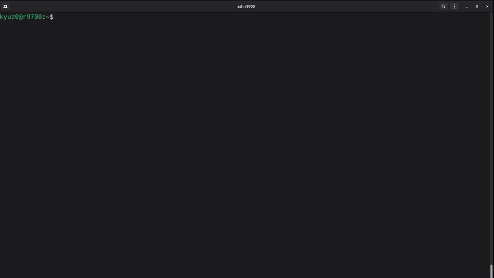

# AMD Radeon 9700 AI PRO (gfx1201) — vLLM Toolbox/Container

An **fedora-based** Docker/Podman container that is **Toolbx-compatible** (usable as a Fedora toolbox) for serving LLMs with **vLLM** on **AMD Radeon R9700 (gfx1201)**. Built on the TheRock nightly builds for ROCM.



---

## Table of Contents

* [Tested Models (Benchmarks)](#tested-models-benchmarks)
* [1) Toolbx vs Docker/Podman](#1-toolbx-vs-dockerpodman)
* [2) Quickstart — Fedora Toolbx (development)](#2-quickstart--fedora-toolbx-development)
* [3) Quickstart — Ubuntu (Distrobox)](#3-quickstart--ubuntu-distrobox)
* [4) Testing the API](#4-testing-the-api)


## Tested Models (Benchmarks)

View full benchmarks at: [https://kyuz0.github.io/amd-r9700-vllm-toolboxes/](https://kyuz0.github.io/amd-r9700-vllm-toolboxes/)


**Table Key:** Cell values represent `Max Context Length (GPU Memory Utilization)`.

| Model | TP | 1 Req | 4 Reqs | 8 Reqs | 16 Reqs |
| :--- | :--- | :--- | :--- | :--- | :--- |
| **`meta-llama/Meta-Llama-3.1-8B-Instruct`** | 1 | 127k (0.98) | 127k (0.98) | 127k (0.98) | 127k (0.98) |
|  | 2 | 105k (0.98) | 105k (0.98) | 105k (0.98) | 105k (0.98) |
| **`openai/gpt-oss-20b`** | 1 | 131k (0.98) | 131k (0.98) | 131k (0.98) | 131k (0.98) |
|  | 2 | 131k (0.95) | 131k (0.95) | 131k (0.95) | 131k (0.95) |
| **`RedHatAI/Qwen3-14B-FP8-dynamic`** | 1 | 41k (0.98) | 41k (0.98) | 41k (0.98) | 41k (0.98) |
|  | 2 | 41k (0.95) | 41k (0.95) | 41k (0.95) | 41k (0.95) |
| **`cpatonn/Qwen3-Coder-30B-A3B-Instruct-GPTQ-4bit`** | 1 | 151k (0.98) | 151k (0.98) | 151k (0.98) | 151k (0.98) |
|  | 2 | 262k (0.98) | 262k (0.98) | 262k (0.98) | 262k (0.98) |
| **`cpatonn/Qwen3-Next-80B-A3B-Instruct-AWQ-4bit`** | 2 | 156k (0.98) | 156k (0.98) | 156k (0.98) | 156k (0.98) |
| **`RedHatAI/gemma-3-12b-it-FP8-dynamic`** | 1 | 45k (0.98) | 45k (0.98) | 45k (0.98) | 45k (0.98) |
|  | 2 | 126k (0.98) | 126k (0.98) | 121k (0.95) | 121k (0.95) |
| **`RedHatAI/gemma-3-27b-it-FP8-dynamic`** | 2 | 60k (0.98) | 60k (0.98) | 60k (0.98) | 60k (0.98) |

### Advanced Tuning

See [TUNING.md](TUNING.md) for a guide on how to enable undervolting and raise the power limit on AMD R9700 cards on Linux to improve performance and efficiency.


---

## 1) Toolbx vs Docker/Podman

The `kyuz0/vllm-therock-gfx1201:latest` image can be used both as: 

* **Fedora Toolbx (recommended for development):** Toolbx shares your **HOME** and user, so models/configs live on the host. Great for iterating quickly while keeping the host clean. 
* **Docker/Podman (recommended for deployment/perf):** Use for running vLLM as a service (host networking, IPC tuning, etc.). Always **mount a host directory** for model weights so they stay outside the container.

---

## 2) Quickstart — Fedora Toolbx (development)

Create a toolbox that exposes the GPU and relaxes seccomp to avoid ROCm syscall issues:

```bash
toolbox create vllm-r9700 \
  --image docker.io/kyuz0/vllm-therock-gfx1201:latest \
  -- --device /dev/dri --device /dev/kfd \
  --group-add video --group-add render --security-opt seccomp=unconfined
```

Enter it:

```bash
toolbox enter vllm-r9700
```

**Model storage:** Models are downloaded to `~/.cache/huggingface` by default. This directory is shared with the host if you created the toolbox correctly, so downloads persist.

### Serving a Model (Easiest Way)

The toolbox includes a TUI wizard called **`start-vllm`** which includes pre-configured models and handles the launch flags for you. This is the easiest way to get started.

```bash
start-vllm
```

> **Cache note:** vLLM writes compiled kernels to `~/.cache/vllm/`.

---

## 3) Quickstart — Ubuntu (Distrobox)

Ubuntu’s toolbox package still breaks GPU access, so use Distrobox instead:

```bash
distrobox create -n vllm-r9700 \
  --image docker.io/kyuz0/vllm-therock-gfx1201:latest \
  --additional-flags "--device /dev/kfd --device /dev/dri --group-add video --group-add render --security-opt seccomp=unconfined"

distrobox enter vllm-r9700
```

> **Verification:** Run `rocm-smi` to check GPU status.

### Serving a Model (Easiest Way)

The toolbox includes a TUI wizard called **`start-vllm`** which includes pre-configured models and handles the launch flags for you. This is the easiest way to get started.

```bash
start-vllm
```

---

## 4) Testing the API

Once the server is up, hit the OpenAI‑compatible endpoint:

```bash
curl -X POST http://localhost:8000/v1/chat/completions \
  -H "Content-Type: application/json" \
  -d '{"model":"Qwen/Qwen2.5-7B-Instruct","messages":[{"role":"user","content":"Hello! Test the performance."}]}'
```

You should receive a JSON response with a `choices[0].message.content` reply.

If you don't want to bother specifying the model name, you can run this which will query the currently deployed model:

```bash
MODEL=$(curl -s http://localhost:8000/v1/models | jq -r '.data[0].id') curl -X POST http://localhost:8000/v1/chat/completions \
  -H "Content-Type: application/json" \
  -d "{
    \"model\": \"$MODEL\",
    \"messages\":[{\"role\":\"user\",\"content\":\"Hello! Test the performance.\"}]
  }"
```

