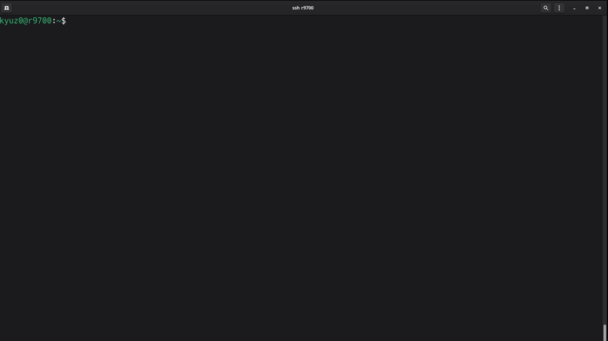

# AMD Radeon 9700 AI PRO (gfx1201) — vLLM Toolbox/Container

An **fedora-based** Docker/Podman container that is **Toolbx-compatible** (usable as a Fedora toolbox) for serving LLMs with **vLLM** on **AMD Radeon R9700 (gfx1201)**. Built on the TheRock nightly builds for ROCM.



---

## Table of Contents

* [Tested Models (Benchmarks)](#tested-models-benchmarks)
* [1) Toolbx vs Docker/Podman](#1-toolbx-vs-dockerpodman)
* [2) Quickstart — Fedora Toolbx](#2-quickstart--fedora-toolbx)
* [3) Quickstart — Ubuntu (Distrobox)](#3-quickstart--ubuntu-distrobox)
* [4) Keeping the Toolbox Up-to-Date](#4-keeping-the-toolbox-up-to-date)
* [5) Testing the API](#5-testing-the-api)
* [6) Use a Web UI for Chatting](#6-use-a-web-ui-for-chatting)


## Tested Models (Benchmarks)

### 🆕 Update (May 4, 2026): ROCm 7.2.1, RCCL Fix & New Models
A new version of the vLLM toolbox has been pushed, built on **ROCm 7.2.1**. It includes a critical fix that downgrades **RCCL to version 7.1.1**, working around a known breakage in the current ROCm release. With this update, the toolbox now fully supports the newest open-weight models, including the **Qwen 3.6 family** and **Gemma-4**.

I have updated the [core benchmarks](https://kyuz0.github.io/amd-r9700-vllm-toolboxes/) to reflect the performance of these new models on the R9700. Please note that the [NVIDIA comparison benchmarks](https://kyuz0.github.io/amd-r9700-vllm-toolboxes/compare.html) are still based on the older December 2025 model data, as I was unable to rerun them on the NVIDIA hardware.

View full benchmarks at: [https://kyuz0.github.io/amd-r9700-vllm-toolboxes/](https://kyuz0.github.io/amd-r9700-vllm-toolboxes/)

*Run benchmarks now include a comparison between the default Triton backend and the optional ROCm attention backend.*


- `meta-llama/Meta-Llama-3.1-8B-Instruct`
- `Qwen/Qwen3.5-9B`
- `cyankiwi/Qwen3.6-27B-AWQ-INT4`
- `cyankiwi/Qwen3.6-35B-A3B-AWQ-4bit`
- `cyankiwi/gemma-4-26B-A4B-it-AWQ-4bit`
- `cyankiwi/gemma-4-31B-it-AWQ-4bit`
- `RedHatAI/Qwen3.6-35B-A3B-FP8`

### Advanced Tuning

See [TUNING.md](TUNING.md) for a guide on how to enable undervolting and raise the power limit on AMD R9700 cards on Linux to improve performance and efficiency.


---

## 1) Toolbx vs Docker/Podman

The `kyuz0/vllm-therock-gfx1201:latest` image can be used both as: 

* **Fedora Toolbx (recommended for development):** Toolbx shares your **HOME** and user, so models/configs live on the host. Great for iterating quickly while keeping the host clean. 
* **Docker/Podman (recommended for deployment/perf):** Use for running vLLM as a service (host networking, IPC tuning, etc.). Always **mount a host directory** for model weights so they stay outside the container.

---

## 2) Quickstart — Fedora Toolbx

Create a toolbox that exposes the GPU and relaxes seccomp to avoid ROCm syscall issues:

```bash
toolbox create vllm-r9700 \
  --image docker.io/kyuz0/vllm-therock-gfx1201:latest \
  -- --device /dev/dri --device /dev/kfd \
  --group-add video --group-add render --security-opt seccomp=unconfined
```

Enter it:

```bash
toolbox enter vllm-r9700
```

**Model storage:** Models are downloaded to `~/.cache/huggingface` by default. This directory is shared with the host if you created the toolbox correctly, so downloads persist.

### Serving a Model (Easiest Way)

The toolbox includes a TUI wizard called **`start-vllm`** which includes pre-configured models and handles launch flags. It also allows you to select the experimental **ROCm attention backend**. This is the easiest way to get started.

```bash
start-vllm
```

> **Cache note:** vLLM writes compiled kernels to `~/.cache/vllm/`.

---

## 3) Quickstart — Ubuntu (Distrobox)

Ubuntu’s toolbox package still breaks GPU access, so use Distrobox instead:

```bash
distrobox create -n vllm-r9700 \
  --image docker.io/kyuz0/vllm-therock-gfx1201:latest \
  --additional-flags "--device /dev/kfd --device /dev/dri --group-add video --group-add render --security-opt seccomp=unconfined"

distrobox enter vllm-r9700
```

> **Verification:** Run `rocm-smi` to check GPU status.

### Serving a Model
Same as above, you can use the **`start-vllm`** wizard to launch models easily.

```bash
start-vllm
```

---

## 4) Keeping the Toolbox Up-to-Date

The `vllm-therock-gfx1201` image patches and tracks AMD ROCm nightlies. To rapidly recreate your toolbox without losing your host-mounted model weights, use the utility script:

```bash
# Pull the script to your local host
curl -O https://raw.githubusercontent.com/kyuz0/amd-r9700-vllm-toolboxes/main/refresh-toolbox.sh
chmod +x refresh-toolbox.sh

# Run to interactively pull 'stable' (latest tag) or 'dev'
./refresh-toolbox.sh
```

This detects Podman/Docker, removes the old container, recreates it with all necessary `seccomp` and GPU volume flags, and prunes orphaned image cache.

---

## 5) Testing the API

Once the server is up, hit the OpenAI‑compatible endpoint:

```bash
curl -X POST http://localhost:8000/v1/chat/completions \
  -H "Content-Type: application/json" \
  -d '{"model":"Qwen/Qwen2.5-7B-Instruct","messages":[{"role":"user","content":"Hello! Test the performance."}]}'
```

You should receive a JSON response with a `choices[0].message.content` reply.

If you don't want to bother specifying the model name, you can run this which will query the currently deployed model:

```bash
MODEL=$(curl -s http://localhost:8000/v1/models | jq -r '.data[0].id') curl -X POST http://localhost:8000/v1/chat/completions \
  -H "Content-Type: application/json" \
  -d "{
    \"model\": \"$MODEL\",
    \"messages\":[{\"role\":\"user\",\"content\":\"Hello! Test the performance.\"}]
  }"
```

---

## 6) Use a Web UI for Chatting

If vLLM is on a remote server, expose port 8000 via SSH port forwarding:

```bash
ssh -L 0.0.0.0:8000:localhost:8000 <vllm-host>
```

Then, you can start HuggingFace ChatUI like this (on your host):

```bash
docker run -p 3000:3000 \
  --add-host=host.docker.internal:host-gateway \
  -e OPENAI_BASE_URL=http://host.docker.internal:8000/v1 \
  -e OPENAI_API_KEY=dummy \
  -v chat-ui-data:/data \
  ghcr.io/huggingface/chat-ui-db
```

