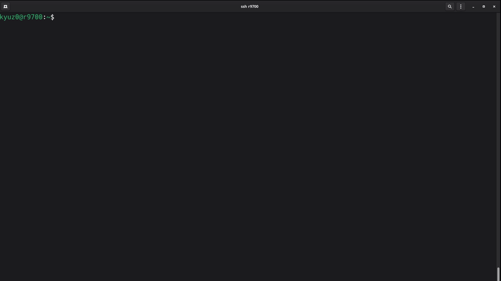

# AMD Radeon R9700 AI PRO (gfx1201) — vLLM Toolbox

A Toolbx-compatible container for serving LLMs with vLLM on AMD Radeon R9700 (gfx1201) GPUs.

## Recommended setup: AI Toolbox Cockpit

[AI Toolbox Cockpit](https://github.com/kyuz0/ai-toolbox-cockpit) is the preferred way to install, launch, and update this container. It provides tested, pre-configured profiles; supports Toolbx and Distrobox; and can run vLLM directly with Podman or Docker, so Toolbx is not required.

```bash
pipx install git+https://github.com/kyuz0/ai-toolbox-cockpit.git
ai-toolbox-cockpit
```

The repository's [`refresh-toolbox.sh`](refresh-toolbox.sh) remains available for manual Toolbx refreshes. The Cockpit is recommended for normal installation and updates.

## Available image channels

| Image | Purpose |
| :--- | :--- |
| `docker.io/kyuz0/vllm-therock-gfx1201:latest` | Verified build recommended for most users. |
| `docker.io/kyuz0/vllm-therock-gfx1201:dev` | Qualification build with newer changes; may be less stable. |



---

## Table of Contents

* [Container options](#container-options)
* [Manual Toolbx setup](#manual-toolbx-setup)
* [Manual Distrobox setup](#manual-distrobox-setup)
* [Testing the API](#testing-the-api)
* [Web UI Integration](#web-ui-integration)
* [Manual updates](#manual-updates)
* [AITER Unified Attention Integration](#aiter-unified-attention-integration)
* [Benchmarks & Tested Models](#benchmarks--tested-models)
* [Advanced Tuning](#advanced-tuning)

---

## Container options

AI Toolbox Cockpit handles the recommended setup for each mode. The image can also be managed manually as:

* **Fedora Toolbx (development):** Shares the host's `HOME` directory and user environment. Best for local development and rapid iterations.
* **Docker/Podman (deployment/performance):** Recommended for serving as a background service. Always mount a host directory for caching model weights.

---

## Manual Toolbx setup

Use this section only if you prefer to manage the Toolbx container yourself. Create it with direct GPU access and relaxed security filters:

```bash
toolbox create vllm-r9700 \
  --image docker.io/kyuz0/vllm-therock-gfx1201:latest \
  -- --device /dev/dri --device /dev/kfd --ipc=host \
  --group-add video --group-add render --security-opt seccomp=unconfined
```

Enter the container:

```bash
toolbox enter vllm-r9700
```

### Serving a Model

Launch the interactive model launcher wizard to select models and configure backends (including AITER):

```bash
start-vllm
```

---

## Manual Distrobox setup

For Ubuntu hosts, use Distrobox to set up the container:

```bash
distrobox create -n vllm-r9700 \
  --image docker.io/kyuz0/vllm-therock-gfx1201:latest \
  --additional-flags "--device /dev/kfd --device /dev/dri --ipc=host --group-add video --group-add render --security-opt seccomp=unconfined"

distrobox enter vllm-r9700
```

Verify GPU visibility using `rocm-smi`, then run the launcher:

```bash
start-vllm
```

---

## Testing the API

Verify the OpenAI-compatible endpoint with a prompt request:

```bash
curl -X POST http://localhost:8000/v1/chat/completions \
  -H "Content-Type: application/json" \
  -d '{"model":"Qwen/Qwen2.5-7B-Instruct","messages":[{"role":"user","content":"Hello! Test the performance."}]}'
```

Alternatively, query the active model dynamically:

```bash
MODEL=$(curl -s http://localhost:8000/v1/models | jq -r '.data[0].id')
curl -X POST http://localhost:8000/v1/chat/completions \
  -H "Content-Type: application/json" \
  -d "{
    \"model\": \"$MODEL\",
    \"messages\":[{\"role\":\"user\",\"content\":\"Hello! Test the performance.\"}]
  }"
```

---

## Web UI Integration

To expose a remote vLLM endpoint, forward port 8000:

```bash
ssh -L 0.0.0.0:8000:localhost:8000 <vllm-host>
```

Run the Hugging Face ChatUI container locally:

```bash
docker run -p 3000:3000 \
  --add-host=host.docker.internal:host-gateway \
  -e OPENAI_BASE_URL=http://host.docker.internal:8000/v1 \
  -e OPENAI_API_KEY=dummy \
  -v chat-ui-data:/data \
  ghcr.io/huggingface/chat-ui-db
```

---

## Manual updates

AI Toolbox Cockpit is the recommended update path. If you created the Toolbx container manually, `refresh-toolbox.sh` can recreate it without losing downloaded model weights. The image provides `latest` and `dev` channels:

```bash
# Pull updates and recreate the container
./refresh-toolbox.sh

# Or install the qualification build from the dev channel
./refresh-toolbox.sh dev
```

The script automatically:
* Detects the container engine (Docker or Podman).
* Removes the existing container while preserving the volume mounts and user cache.
* Recreates the container with the correct GPU devices (`/dev/dri`, `/dev/kfd`), host IPC for multi-GPU shared memory, group permissions (`video`, `render`), and seccomp profile (`unconfined`).
* Prunes orphaned image layers to free disk space.

---

## AITER Unified Attention Integration

The AITER Unified Attention backend (Triton-based kernels) is supported to resolve long-context performance issues on R9700 (gfx1201) hardware.

This integration was inspired by community findings documented in:
* **[For the 5 people here running vLLM on multiple R9700s, you need to patch in support for AITER Unified Attention](https://www.reddit.com/r/LocalLLaMA/comments/1sxaj8g/for_the_5_people_here_running_vllm_on_multiple/)**

### Technical Changes
- **Architecture Validation & Aliasing:** Patched vLLM's `rocm.py` to include `gfx1201` in `_ON_MI3XX` (enabling AITER code paths) and aliased `gfx1201` to `MI350X` in the AITER internal architecture map to prevent key errors.
- **Build-Time hipcc Wrapper:** Modified the Docker build to rename the real `hipcc` binary and replace it with a wrapper that intercepts `--offload-arch=native` and rewrites it to `--offload-arch=gfx1201`. This allows JIT compilation without requiring elevated runtime privileges.
- **Subsystem Controls:** Configured vLLM to only load Triton-based attention kernels while disabling C++/HIP JIT-compiled subsystems (RMSNorm, FP8BMM, FP4BMM, Triton ROPE) that freeze during compilation on RDNA4.
- **Tooling & Dashboard:** Updated `start_vllm.py` and `run_vllm_bench.py` to support the `--attention-backend ROCM_AITER_UNIFIED_ATTN` flag and configured the parsed logs and dashboard UI to display AITER benchmarks.

---

## Benchmarks & Tested Models

Core benchmarks comparing Triton, ROCm, and AITER performance on the R9700 are available at:
👉 **[https://kyuz0.github.io/amd-r9700-vllm-toolboxes/](https://kyuz0.github.io/amd-r9700-vllm-toolboxes/)**

The following models have been tested and verified:
- `meta-llama/Meta-Llama-3.1-8B-Instruct`
- `Qwen/Qwen3.5-9B`
- `cyankiwi/Qwen3.6-27B-AWQ-INT4`
- `cyankiwi/Qwen3.6-35B-A3B-AWQ-4bit`
- `cyankiwi/gemma-4-26B-A4B-it-AWQ-4bit`
- `cyankiwi/gemma-4-31B-it-AWQ-4bit`
- `RedHatAI/Qwen3.6-35B-A3B-FP8`

---

## Advanced Tuning

See [TUNING.md](TUNING.md) to configure undervolting and raise the power limit on AMD R9700 cards to maximize performance.
